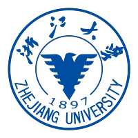
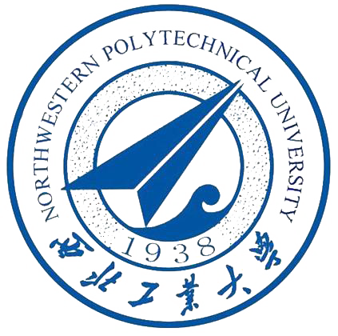
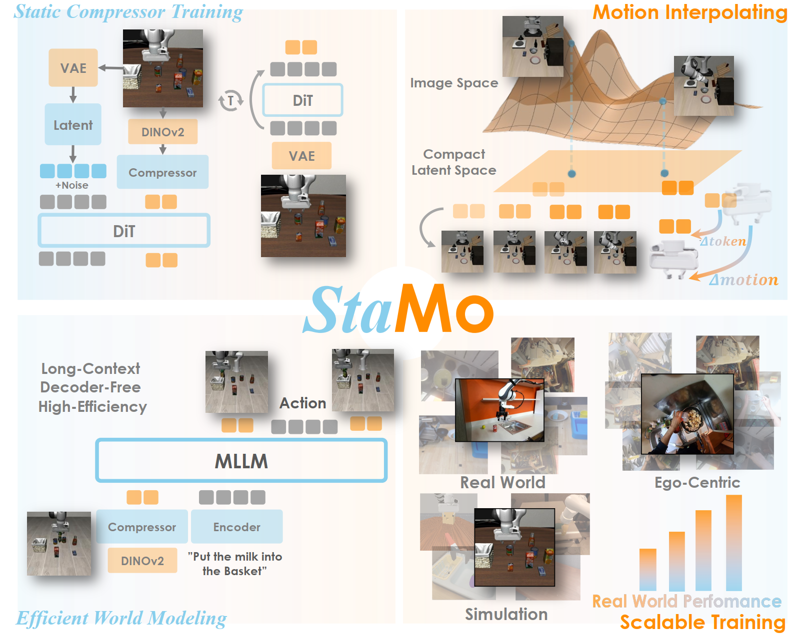

<html> 
<head>
    
</head>
<body>
<h1 class="main-heading">👋 Hello, World! Welcome to My Space 🚀</h1>

last update: 2026.04

</body>
</html>

我是一名来自[西北工业大学](https://www.nwpu.edu.cn/){:target="_blank"}计算机学院人工智能专业的大四本科生。我的研究兴趣聚焦于**世界模型**和**具身智能**。

Latest News
======

- 📝 **[2026.04]** 我们的工作 StaMo 被选为 CVPR 2026 **Highlight**！

- 🎉 **[2026.02]** 一篇工作被 **CVPR 2026 main** 接收！一篇工作被推荐至 **findings**！

- 🎓 **[2025.10]** 荣获**腾讯特等奖学金**（本科生唯一获奖者）、校级**双创之星**（全校 10 人）、**校优秀大学生及一等奖学金**。

- 📍 **[2025.07]** 开始在浙江大学 [CAD&CG](http://www.cs.zju.edu.cn/csen/){:target="_blank"} 全国重点实验室的 [AIM](https://aim-uofa.github.io/){:target="_blank"} 实验室实习，师从[**陈昊**](https://stan-haochen.github.io/){:target="_blank"}研究员和[**沈春华**](https://cshen.github.io/){:target="_blank"}教授。

- 🥇 **[2025.07]** 在**中国机器人与人工智能大赛**（[CRIC](https://www.caairobot.com/){:target="_blank"}）全国决赛中，凭借大倾角条件下的卫星-无人机景象匹配定位算法，斩获**国家级一等奖**。

 📚 更多动态 

- 🏆 **[2025.05]** 作为团队负责人，带领团队在[**"挑战杯"全国大学生课外学术科技作品竞赛**](https://www.tiaozhanbei.net/){:target="_blank"}中，凭借视感定一体化视觉基座模型，荣获**省级特等奖**。

- 🥇 **[2025.05]** 担任超算队队长，带领团队在 [**ASC 世界大学生超级计算机竞赛**](https://www.asc-events.net/StudentChallenge/index.html){:target="_blank"}决赛中取得**国际级一等奖**（全球初赛第10名、总决赛第13名）。全面负责团队任务协调、资源分配及技术方案设计，重点完成AlphaFold3与DeepSeek在CPU上的推理性能优化（分别实现 10x 和 7x 加速），并有幸向**图灵奖得主 [Jack Dongarra](https://www.netlib.org/utk/people/JackDongarra/){:target="_blank"} 教授**作技术报告。

- 🌏 **[2025.04]** 前往[**立命馆大学**](https://www.ritsumei.ac.jp/){:target="_blank"}（Ritsumeikan University）（日本·京都）参加短期访学交流活动。

- 🥇 **[2025.01]** 在[**美国大学生数学建模竞赛**](https://www.comap.com/contests/mcm-icm){:target="_blank"}中，荣获**国际级一等奖（M奖）**。

- 🧠 **[2024.12-2025.01]** 在**西安讯飞超脑信息科技有限公司**（科大讯飞全资子公司）实习，担任**助理研究算法工程师**。参与题目语义去重任务，通过超参搜索和提示词工程，将模型零样本正确率从 63% 提升至 94%，被评为**优秀实习生**。

- 🎓 **[2024.12]** 荣获**校优秀大学生及二等奖学金**、**铂力特二等专项奖学金**。

- 🥈 **[2024.10]** 作为团队负责人，带领团队在[**中国国际大学生创新大赛（2024）**](https://cy.ncss.cn/){:target="_blank"}全国决赛中荣获**国家级银奖**。

- 🥈 **[2024.09]** 在[**全国大学生数学建模竞赛**](https://www.mcm.edu.cn/){:target="_blank"}中，荣获**国家级二等奖**。

- 🌏 **[2024.07]** 前往[**香港理工大学**](https://www.polyu.edu.hk/){:target="_blank"}（PolyU）（中国·香港）参加"数学之旅"暑期访学交流项目。

- 📚 **[2024.07]** 前往西藏林芝参加"揭榜挂帅"助力祖国边疆地区高质量发展社会实践项目，获评**社会实践先进个人**，项目被推荐为**教育部优秀社会实践案例**。

- 📝 **[2024.01]** 完成并提交首篇**国家发明专利**《一种用于视觉语言导航任务的数据增广方法》。

- 🎓 **[2023.12]** 荣获**校优秀大学生及一等奖学金**、**吴亚军三等专项奖学金**。

Experiences
======

  

      
      

          <strong><a href="https://www.zju.edu.cn/" target="_blank">浙江大学</a></strong> 
          2025.06 - 至今 
          <a href="https://aim-uofa.github.io/" target="_blank"><em>AIM Lab</em></a> 研究实习生
      

  

  

      
      

          <strong><a href="https://en.nwpu.edu.cn/" target="_blank">西北工业大学</a></strong> 
          2022.09 - 2026.06 
          工学学士，导师 <a href="https://teacher.nwpu.edu.cn/pengwang.html" target="_blank"><em>王鹏教授</em></a>
      

  

Research & Publications
======

我的研究工作主要集中在**机器人学习**和**世界模型**等方向：

 
  
  

    <h3><a href="https://aim-uofa.github.io/StaMo/" target="_blank">StaMo: Unsupervised Learning of Generalizable Robot Motion from Compact State Representation</a></h3>
    
Mingyu Liu*, <b>Jiuhe Shu*</b>, Hui Chen, Zeju Li, Canyu Zhao, Jiange Yang, Shenyuan Gao, Hao Chen, Chunhua Shen

    
Conference on Computer Vision and Pattern Recognition (CVPR) 2026

    

      <i>&#9733; Highlight Presentation(3.1% in all submission) &#9733;</i> 
      <a href="https://aim-uofa.github.io/StaMo/" target="_blank">Webpage</a>&nbsp;&nbsp;&bull;&nbsp;&nbsp;
      <a href="https://arxiv.org/abs/2502.17157" target="_blank">PDF</a>&nbsp;&nbsp;&bull;&nbsp;&nbsp;
      <a href="https://github.com/aim-uofa/StaMo" target="_blank">Code</a>
    

  

Contributions
======

<a href="https://github.com/huggingface/lerobot" target="_blank">🤗 huggingface/lerobot</a>

贡献者 | GitHub 23k+ stars 🌟

贡献PR，当指定episodes并需要索引重新映射时，提高了DatasetReader的初始化性能，加速了模型训练过程的数据加载效率。

<a href="https://github.com/huggingface/lerobot" target="_blank">Code</a>

<a href="https://github.com/Hagb/docker-easyconnect" target="_blank">🐳 docker-easyconnect</a>

贡献者 | GitHub 5k+ stars 🌟 | Docker Hub 100k+ downloads

贡献PR，实现chromium最小化适配并集成至项目镜像，成功解决部分网络工具必须通过web端完成登录的适配问题，进一步完善项目的使用场景和适配能力。

    <a href="https://github.com/Hagb/docker-easyconnect" target="_blank">GitHub</a>&nbsp;&nbsp;&bull;&nbsp;&nbsp;
    <a href="https://hub.docker.com/r/hagb/docker-easyconnect" target="_blank">Docker Hub</a>

Projects
======

<a href="https://www.asc-events.net/StudentChallenge/History/2025/index.html" target="_blank">🖥️ ASC 世界大学生超级计算机竞赛</a>

ASC25 国际级一等奖 | NWPU 超算队队长 | 2024.12 - 2025.05

全面负责团队在ASC超算竞赛中的技术方案设计与实施。针对AlphaFold3与DeepSeek大模型，基于Google JAX pre-compile、Intel OneCCL通信库、XFT并行框架与vLLM推理引擎构建多节点并行推理方案，在4个CPU节点上实现AlphaFold3性能提升10倍以上、DeepSeek推理速度提升约7倍。

Honors & Awards
======

<h3>🏆 奖学金</h3>
<ul>
<li>腾讯特等奖学金（本科生唯一获奖者，2025）</li>
<li>校级一等奖学金（2023、2025）</li>
<li>校级二等奖学金（2024）</li>
<li>铂力特二等专项奖学金（2024）</li>
<li>吴亚军三等专项奖学金（2023）</li>
</ul>

<h3>🎖️ 荣誉称号</h3>
<ul>
<li>双创之星（全校10人，2025）</li>
<li>校优秀大学生（2023、2024、2025）</li>
</ul>

<h3>🥇 竞赛获奖（部分）</h3>
<ul>
<li>ASC世界大学生超级计算机竞赛 - <strong>国际级一等奖</strong>（2025）</li>
<li>中国机器人及人工智能大赛 - <strong>国家级一等奖</strong>（2025）</li>
<li>美国大学生数学建模竞赛 - <strong>国际级一等奖/M奖</strong>（2025）</li>
<li>中国国际大学生创新大赛 - 国家级银奖（2024）</li>
<li>全国大学生数学建模竞赛 - 国家级二等奖（2024）</li>
<li>"挑战杯"全国大学生课外学术科技作品竞赛 - 省级特等奖（2025）</li>
</ul>

